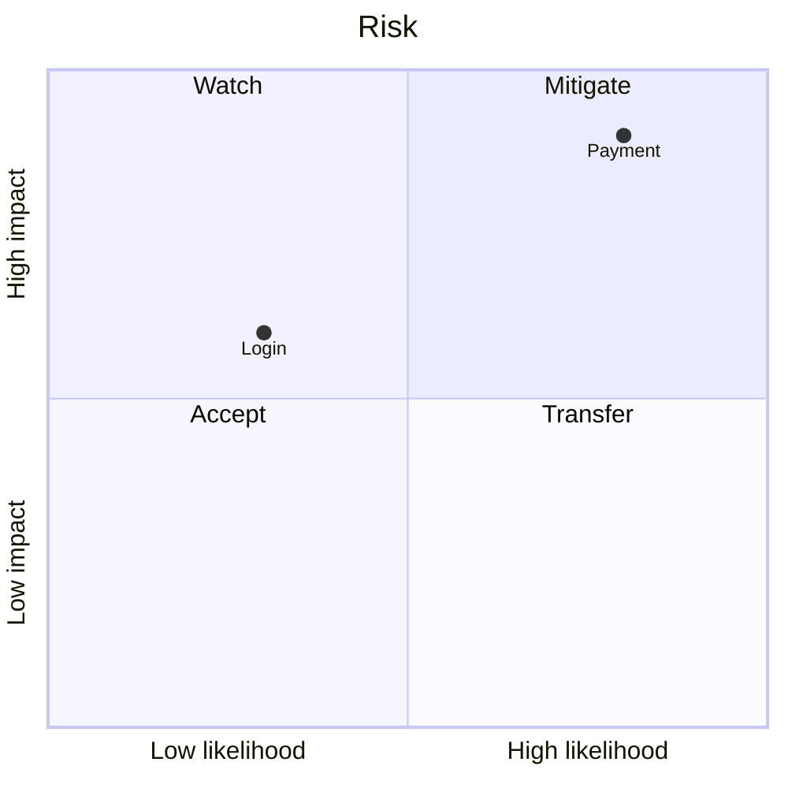

# Charts

```mermaid
quadrantChart
  title Risk
  x-axis Low likelihood --> High likelihood
  y-axis Low impact --> High impact
  quadrant-1 Mitigate
  quadrant-2 Watch
  quadrant-3 Accept
  quadrant-4 Transfer
  Login: [0.3, 0.6]
  Payment: [0.8, 0.9]
```

```mermaid
xychart-beta
  title "Defects per sprint"
  x-axis [s1, s2, s3, s4]
  y-axis "Defects" 0 --> 20
  line [12, 9, 6, 4]
```
